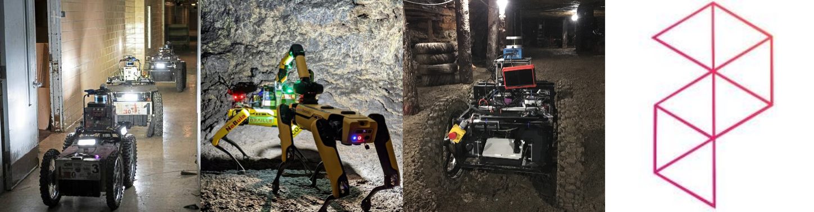

:sectnums:
:sectnumlevels: 1
:toc: macro
:toclevels: 2

toc::[]

== Overview
In traditional Multi-Agent Exploration (MAE) methods, all agents start in the same place and start with a shared coordinate system; and once the relative transformation missed due to localization failures, the MAE system will be very fregial and easily crash. This framework provide a novel Autonomous Exploration paradigm, all the agents can start in the darkness, without knowing anything about *where they are*, *where each other are*, and *what the environment looks like*. As the MAE system explorer individually, *MetaUnion* helps to find associated overlaps among different agents and solve the above three challenges gradually; and most importantly, *MetaUnion* can incrementally update the feature learning ability for new observed areas. In a summary, our key contributions includes:

* *Multi-Agent Localiztion without Initial Transformation;*
* *Multi-Agent Hierarchical Exploration;*
* *Incremental Lifelong Localization.*

=== System Structure

image::doc/images/MetaUnion.png["MetaUnion", width=850px]

MetaUnion mainly contains three key modules within the framework: *AutoMerge*, *MrExplorer*, and *BioSLAM*. In the begining, each agent is randomly assigned at a new envionrment, and has neither information about other agents' localization, nor place recognition ability for the new areas, and conduct single-agent exploration individually.
When the trajectries of different agents have overlaps, *AutoMerge* module can automatically detect the data association between agents, and estimate the relative positions for them. Based on the relative transformation, *MrExplorer* can divide the agent into different groups based on their connections, and apply hierarichal exploration for individual agent. Parallel with the above procedure, *BioSLAM* constructs a dual-memory system to memorize the large-scale and long-duration place features. As the MAS system explorer to bigger area, their cooperation ability and place recognition ability are improved gradually.

== Software

To quickly install all the necessary softwares for MetaUnion, please following the instructions,
[source,bash]
----
git clone --recurse-submodules -j8 https://github.com/MetaSLAM/MetaUnion.git
sh install.sh
echo "export MetaUnion=/home/codespace/MetaUnion" >> ~/.bashrc
echo "export META_AUTOMERGE=$MetaUnion/stack/AutoMerge" >> ~/.bashrc
echo "export META_EXPLORER=$MetaUnion/stack/MrExplorer" >> ~/.bashrc
echo "export META_SIM=$MetaUnion/stack/Multi-Agent-Simulation" >> ~/.bashrc
source ~/.bashrc
----
Please keep in mind, *META_AUTOMERGE*, *META_EXPLORER* and *META_SIM* indicate the *PATH* env for the three key modules. In the following sections, we will investigate the details of each module.

=== AutoMerge

image::doc/images/AutoMerge.png["System", width=800px]

Within AutoMerge, all the agent

==== TODOLIST
[options="interactive"]
* [ ] [red yellow-background]#*Onine SubMap Generation*#
* [ ] [red yellow-background]#*Onine Feature Evaluation*#
* [ ] [red yellow-background]#*Onine Cache Checking*#
* [ ] [red yellow-background]#*Onine Position Estimation*#

=== MrExplorer

=== BioSLAM

== Multi-Agent Localization

[source,yaml]
----
DATA:
    OFFLINE_LENGTH: 100 # Set for desire testing length
----
Use `OFFLINE_LENGTH` to set the length for each agent.

[source,bash]
----
python src/offline_merging.py
----

In the current `global_rough_align` step, we will use spectral clustering method to divide agents into different groups based on their connections.

== Multi-Agent Exploration

=== Start Docker

[source,bash]
----
cd AUTOMERGE
sh doc/bin/start_docker.sh
sh tmux_run.sh
----

This will enable the `metaslam/automerge` docker image, within which we already enabled the LiDAR odometry and AutoMerge Server. 
The `tmux_run.sh` will automatically trigger `online_detector.py` and `online_merging.py`.
Note, we also need to trigger `online_visualizer.py` for online visualization (in progress).

=== Visualization

Outside the docker, subscibe `/global_map` with `world` frame with `rviz`. Different un-merged maps will be visualized along the z-axis (`index*30`).

== Lifelong Localization

See the demo tutorial in the link:tests/demo.ipynb[jupyter] and link:tests/test.py[python] version.

=== Configure Datasets

Download Pittsburgh datasets for online map merging.
https://drive.google.com/drive/folders/19AK8jc6yZpKN6Ub_ILGJaceZixpbwKcV?usp=sharing

Download pre-trained models and set path
[source,bash]
----
cd data && sh download.sh
echo "export ROS_IP='172.17.0.1' " >> ~/.bashrc
echo "export MASTER_IP='172.17.0.2' " >> ~/.bashrc
echo "export ROS_MASTER_URI=http://$MASTER_IP:11311/ " >> ~/.bashrc
echo "export BAG_PATH='$PATH_TO_PITT_ROS_BAGS' " >> ~/.bashrc
source ~/.bashrc
----
And the following difference matrix in the `data/results/`. Then set `ROS_IP` to enable communication between docker and host computer.
Finally, export dataset path, and replace `PATH_TO_PITT_ROS_BAGS` to the Pittusbrugh rosbags.

== TODO List
